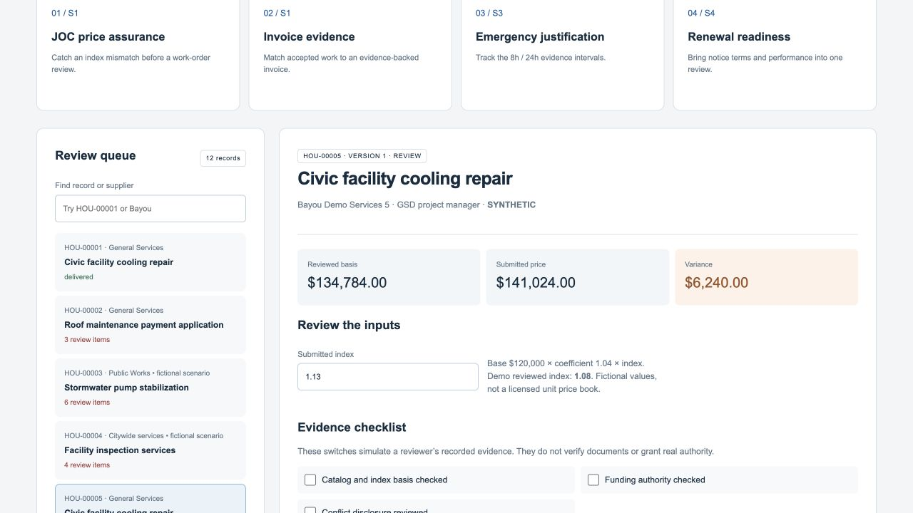

# Houston procurement intelligence • PUG example

A portable, Houston-informed procurement demonstration with a branded control room, four interactive scenarios, a source register, PlantUML diagrams, a LaTeX technical report, and a real local FastAPI backend.

**Independent concept. Not a City of Houston service, procurement policy engine, or endorsed docusign/SAP integration. All suppliers and transactions are fictional.** No provider requests, sends, payments or remote deletes occur. The example's API usage charges are zero because it has no outbound provider client; installing dependencies is ordinary package-download traffic.



## Run on another machine

Python 3.11–3.14 is the intended range; verification records the versions actually tested.

```sh
git clone --branch examples/reviewed-demo-collection https://github.com/toms-iam-demos/python-unified-gateway.git
cd python-unified-gateway/examples/houston-procurement-demo
python -m venv .venv
```

macOS/Linux:

```sh
source .venv/bin/activate
python -m pip install -r requirements.txt
python run.py
```

Windows PowerShell (activation optional):

```powershell
.\.venv\Scripts\python.exe -m pip install -r requirements.txt
.\.venv\Scripts\python.exe run.py
```

Open **http://127.0.0.1:8089/**. Stop with **Ctrl+C**. Restart with the same command; local state survives. Use `python run.py --port 8090` if 8089 is occupied. No Java, database service, Node, API key or PUG deployment is required. Do not reuse another example's virtual environment on the work machine.

If the repository is already cloned, save unrelated work before switching branches. Fetch the branch and inspect it rather than overwriting your checkout. Publishing an example branch does not merge it into `main` or deploy `api.tifirmo.io`.

## Eight-minute demonstration

1. Generate 12 records; select **JOC price assurance**. A synthetic submitted index of 1.13 produces a $6,240 variance against the reviewed 1.08 basis.
2. Set submitted index to **1.08**. Simulate the three evidence reviews, save, and prepare the handoff. Inspect the immutable command.
3. Approve as demo reviewer. Select **Simulate lost response**, deliver, replay the same command, then reconcile. Only one inbox receipt exists.
4. Open **Invoice evidence**. Try an invoice above 4,800,000 cents; save and see the gate. Restore the amount and complete the checklist. This produces a review packet, not a payable.
5. Open **Emergency justification**. Enter contact hour 9 and form hour 25 with elapsed 26. Complete the synthetic evidence. The late history remains visible; the packet can be reviewed without backdating.
6. Open **Renewal readiness**. A fictional 90-day term yields an October 17, 2026 notice date, ten days after the fixed demo date. It is not a Houston-wide rule.
7. Visit **Policy & research** for evidence and limitations; **Connected workflow** for PlantUML diagrams; **Integration lab** to authorize Swagger with a process-scoped local token.
8. Export evidence. Preview and confirm cohort reset. Generate 10,000 records; search `HOU-10000` and filter all four scenarios. Fixture contents repeat deterministically; cohort IDs are unique.

## Verify

```sh
python -m pip install -r requirements-dev.txt
python -m pytest -q
```

The full report also opens as a readable HTML page from the Policy & research tab; its canonical source is LaTeX.

See [VERIFICATION.md](VERIFICATION.md) for actual test results. See [technical report](docs/Houston-Procurement-IAM-Technical-Report.tex), [implementation map](docs/IMPLEMENTATION.md), and [source register](docs/sources.json).

## Safety and extension boundaries

- Loopback-only launcher, host/origin checks, process token and restrictive site CSP.
- Input whitelist, version-bound plans, digest and duplicate checks, scoped cleanup.
- Local personas are **not** enterprise identity or independently enforced approval roles.
- SQLite audit is **not** immutable or tamper-evident storage.
- Example policies are not legal advice or a current city policy certification. No monetary procurement threshold, racial participation rule, automatic award or payment release is encoded.
- Runtime data, virtual environments and `.env` stay Git-ignored. The city seal and skyline image are attributed public-site assets; no actual supplier record, signature image or licensed pricing catalog is included. See [branding provenance](docs/BRANDING.md) for sources, rights notes and the distinction between city identity and our proposed staff portal.
- A real IAM/SAP adapter requires its own identity, entitlements, policy validation, rate limits, tenant isolation and integration tests. Current GitHub publication changes no production gateway routes.
